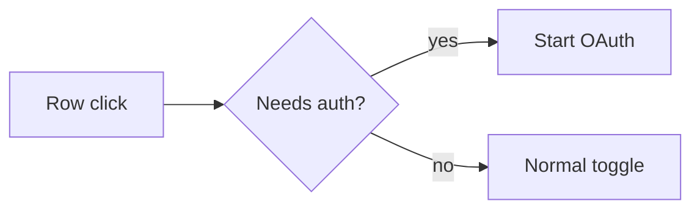

# PR Notes

**PR descriptions that explain the change before the reviewer opens the diff.**

PR Notes is an Agent Skill for turning a code change into concise review context.

| | |
|---|---|
| **Change** | what was wrong and what happens now |
| **Before / after** | visual or measurable evidence |
| **Flow** | the changed path, when it is not obvious |
| **Implementation** | only correctness-critical details |
| **Verification** | checks tied to behavior and regressions |

## What it produces

### What changed

Clicking an MCP server row that required sign-in disabled the server. Row clicks now start sign-in while the switch still controls enabled state.

### Before / after

| Before | After |
|---|---|
| Row click turns the server off | Row click opens sign-in and keeps it enabled |

### Flow



### Implementation

- Auth-required rows remain enabled while disconnected.
- Direct switch clicks keep the existing toggle behavior.
- Non-auth rows are unchanged.

### Verification

- [x] Auth-required row click starts sign-in.
- [x] Direct switch click still toggles enabled state.
- [x] Non-auth rows behave as before.

That is the whole idea: make the behavior delta obvious, show evidence, explain the branch if needed, and stop.

## Use

```bash
git clone https://github.com/skcache/prnotes.git
```

Give your agent access to `SKILL.md`. For clients that support the Agent Skills format, place this folder in the client's skills directory and invoke **PR Notes** when writing or rewriting a pull request description.

PR Notes adapts to the change. Tiny fixes do not get decorative diagrams. Refactors do not get fake before/after sections. Performance changes use measured deltas. Missing evidence stays missing.

## Structure

```text
prnotes/
├── SKILL.md
├── AGENTS.md
├── README.md
├── LICENSE
├── examples/
├── evals/
├── references/
└── templates/
```

`SKILL.md` is the skill. The other directories provide examples, evaluation cases, reference principles, and a reusable PR template.

## Principles

- behavior before implementation
- evidence before prose
- diagrams only when they clarify a real branch
- preserved behavior stated explicitly
- verification tied to the changed path
- no invented screenshots, metrics, tests, or claims
- delete anything that does not help review

## Inspiration

Inspired by a public PR-writing example shared by [Luke Parker](https://x.com/LukeParkerDev), especially the combination of concise behavior description, before/after evidence, and a compact control-flow diagram.

PR Notes generalizes that presentation pattern into a reusable Agent Skill.

## License

MIT
