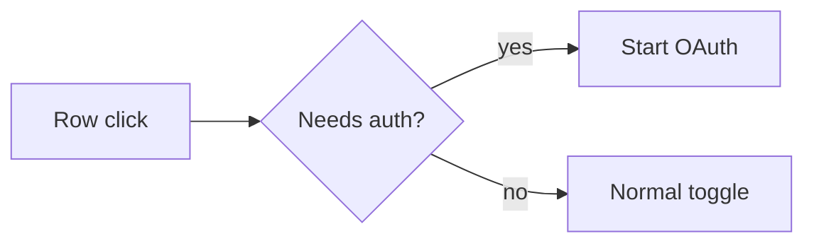

# prnotes

[](https://skills.sh/skcache/prnotes/pr-notes)
[](https://github.com/numman-ali/openskills)
[](https://docs.openclaw.ai/skills)
[](LICENSE)

**PR Notes**

AI agents can write the code fast.

The reviewer still has to figure out what actually changed.

`prnotes` turns a code change into a concise review note with:

- exact behavior delta
- before / after evidence: captured screenshots for anything visual, measured numbers for anything measured
- a small flow diagram when the changed path is non-obvious
- correctness-critical implementation details
- preserved behavior and verification tied to the changed path

## How it works

The agent reads the actual diff and the available evidence first.

Then it writes the smallest note that makes the change obvious.

A tiny fix stays tiny.

A UI change gets matched before / after captures, cropped to the region that moved.

A performance change uses measured deltas, or says it was not measured.

A refactor explains the preserved contract.

Missing evidence stays missing.

## Example

A PR note as it renders on GitHub:

### What changed

Clicking an MCP server row that required sign-in disabled the server.
Row clicks now start sign-in while the switch still controls enabled state.

#### Before / after

| Before | After |
|---|---|
| `` | `` |

#### Flow



#### Implementation

- Auth-required rows stay enabled and disconnected until authentication completes.
- Direct switch clicks keep the existing toggle behavior.

#### Verification

- [x] Auth-required row click starts sign-in (manual run, captured above)
- [x] Direct switch click still toggles enabled state (`toggle.test.ts`)
- [ ] Keyboard activation (not run)

Captures are written to a gitignored `.pr-notes/` directory and stay out of the diff.

## Install

```bash
npx skills add skcache/prnotes
```

For Codex:

```bash
npx skills add skcache/prnotes -a codex
```

For Claude Code:

```bash
npx skills add skcache/prnotes -a claude-code
```

For OpenClaw:

```bash
openclaw skills install skills-sh:skcache/prnotes/pr-notes
```

For OpenSkills:

```bash
npx openskills install skcache/prnotes
```

The `skills` CLI supports a bunch of coding agents and installs skills directly from GitHub.

## Update

```bash
npx skills update pr-notes
```

`metadata.version` in `SKILL.md` is for human release tracking; the CLI finds updates from the source repo, not this field.

## Use

Inside a repository:

```text
Use the pr-notes skill.
Inspect this change and write the PR description.
```

## Inspiration

Inspired by a PR-writing example from [Luke Parker](https://x.com/LukeParkerDev): a short behavior description, before / after evidence, and a compact flow diagram.

`prnotes` generalizes that pattern into a reusable Agent Skill.

## License

MIT
