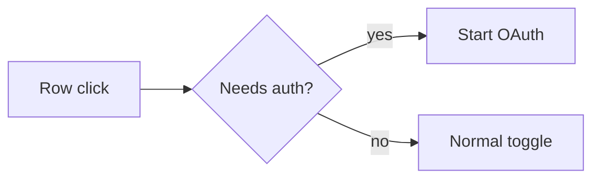

# prnotes

[](https://skills.sh/skcache/prnotes/pr-notes)
[](https://github.com/numman-ali/openskills)
[](https://docs.openclaw.ai/skills)
[](LICENSE)

**PR Notes**

AI agents can write the code fast.

The reviewer still has to figure out what actually changed.

`prnotes` turns a code change into a concise review note with:

- exact behavior delta
- before / after evidence
- a small flow diagram when the changed path is non-obvious
- correctness-critical implementation details
- verification and preserved behavior

## How it works

The agent inspects the actual diff and available evidence first.

Then it writes the smallest PR note that makes the change obvious.

A tiny fix stays tiny.

An interaction change can get before / after evidence and a compact Mermaid flow.

A performance change uses measured deltas.

A refactor explains the preserved contract instead of inventing a fake UX story.

Missing evidence stays missing.

## Example

```md
## What changed

Clicking an MCP server row that required sign-in disabled the server.
Row clicks now start sign-in while the switch still controls enabled state.

### Before / after

| Before | After |
|---|---|
| Row click turns the server off | Row click opens sign-in and keeps it enabled |

### Flow
```



```md
### Implementation

- Auth-required rows remain enabled while disconnected.
- Direct switch clicks keep the existing toggle behavior.
- Non-auth rows are unchanged.

### Verification

- [x] Auth-required row click starts sign-in.
- [x] Direct switch click still toggles enabled state.
- [x] Non-auth rows behave as before.
```

## Install

```bash
npx skills add skcache/prnotes
```

For Codex:

```bash
npx skills add skcache/prnotes -a codex
```

For Claude Code:

```bash
npx skills add skcache/prnotes -a claude-code
```

For OpenSkills:

```bash
npx openskills install skcache/prnotes
```

The `skills` CLI supports multiple coding agents and installs skills directly from GitHub.

## Update

```bash
npx skills update pr-notes
```

## Use

Inside a repository:

```text
Use the pr-notes skill.
Inspect this change and write the PR description.
```

That's it.

The diff stays precise.

The PR becomes readable.

## Inspiration

Inspired by a public PR-writing example shared by [Luke Parker](https://x.com/LukeParkerDev), especially the combination of concise behavior description, before / after evidence, and a compact control-flow diagram.

`prnotes` generalizes that presentation pattern into a reusable Agent Skill.

## License

MIT
