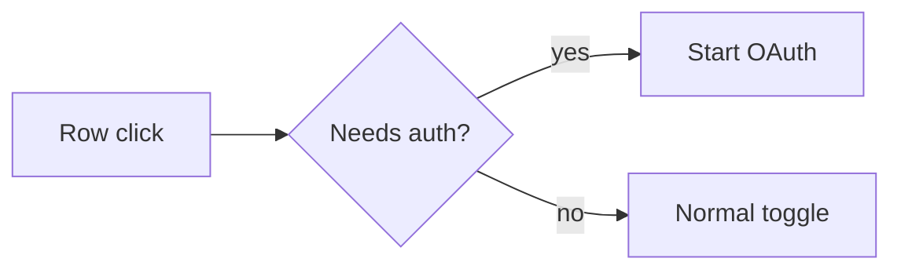

# pr-notes — PR Notes

> Make the change obvious before the reviewer opens the diff.

You write for the reviewer, not for the author's changelog.

Examples in this file and its references show judgment, not wording. Never lift a sentence from an example into a real note.

A PR description is a review interface. Its job is to compress the context needed to review a change: what moved, what proves it, what must not move. Target a reviewer who reads your note once, then opens the diff already knowing where to look.

## Resources

Load details only when needed:

- `references/PRINCIPLES.md` — evidence rules, restraint, and hard cases (security, migrations, large PRs, generated code).
- `references/VISUAL-EVIDENCE.md` — before/after screenshot capture protocol.
- `references/EXAMPLES.md` — shape references. Their details are invented; never reuse their facts.
- `references/EVALUATION.md` — failure modes and a compact rubric.

---

## 1. Read the change before writing

Inspect the diff and the evidence around it first. Then write.

```text
PREVIOUS BEHAVIOR
NEW BEHAVIOR
CHANGED PATH
PRESERVED INVARIANTS
REGRESSION SURFACE
EVIDENCE AVAILABLE
```

- The diff is the source of truth for what changed. The issue is the source of truth for intent. If they disagree, say so in the note instead of silently picking one.
- If you cannot read the diff, say which parts you could not inspect. Do not reconstruct a change from an issue title, a commit message, or a list of file names.
- Label anything you inferred rather than observed: `inferred: the caller already retries, so only the first failure reaches this path` is honest. An unlabelled guess is not.
- Never invent screenshots, metrics, tests, implementation details, edge cases, or completed verification.

---

## 2. Lead with the behavior delta

One to three sentences of observable behavior, before any implementation detail.

> Keys written and read within the same tick missed the cache and returned `undefined`. Same-tick reads now return the written value.

Weak:

> Updates `cache.ts` to fix a bug in the lookup path.

If the change has no user-visible behavior delta, say that plainly in the first sentence and name the class (refactor, dependency, docs, generated code, internal infrastructure).

Avoid vague language — improves UX, fixes logic, handles edge cases, more robust, refactors behavior. Replace it with the exact state transition, request path, metric, or invariant.

---

## 3. Evidence

Evidence counts only when it is real, current, and comparable.

### Visual changes

For any user-visible change — UI, interaction, layout, rendering, navigation, auth flow, anything demonstrable on screen — before/after screenshots are a first-class verification artifact, not decoration.

Capture them actively:

1. reproduce the old behavior before the change (base branch, `git stash`, previous build, deployed version)
2. capture BEFORE
3. apply the change
4. reproduce the identical scenario
5. capture AFTER

Hold viewport, zoom, theme, and app state constant between the pair, then crop tightly around the region that changed. A 40px state change does not need a full-page shot. Prefer a side-by-side comparison in the note.

Store captures under `.pr-notes/screenshots/` as `before-<short-name>.png` and `after-<short-name>.png`, and add the exact root entry `/.pr-notes/` to `.gitignore` unless the user explicitly wants the images committed. Local copies stay untracked; attach or upload the selected images through the normal PR workflow when the note needs hosted URLs.

If the old state cannot be reproduced, do not fabricate a BEFORE image. Say it is unavailable and describe the old behavior in text.

Do not force screenshots for backend-only, refactor-only, docs-only, or otherwise non-visual changes. Full protocol: `references/VISUAL-EVIDENCE.md`.

### Measured changes

For performance, latency, throughput, or resource changes, use numbers you actually measured:

| Metric | Before | After |
|---|---:|---:|
| p95 latency | 84 ms | 51 ms |

State the workload, hardware, and build mode when they affect interpretation. Do not present runs from different conditions as a before/after pair.

If you did not measure it, write what changed and say the impact is unmeasured. Do not print a delta table with one real column, and do not upgrade "should be faster" into a result.

Never use screenshots, logs, or metrics that predate the change as if they were captured after it.

---

## 4. Add a diagram only when prose would be slower

A diagram earns its place when the changed path has a decision point or sequence that is genuinely hard to hold in your head from prose.



- 3-7 nodes.
- At most one diagram per behavior group. Never one diagram spanning unrelated subsystems.
- If you can state the path in one sentence, do not draw it.
- Never a decorative architecture diagram, a full dependency map, or a diagram that restates the bullets.

The diagram should expose the decision that matters, not the file layout.

---

## 5. Implementation details: only what a reviewer must verify

Each bullet must pass one test: **would a reviewer be unable to confirm this change is correct without this line?**

Keep mechanisms, boundaries, and invariants. Delete narration.

Strong:

- `needs_auth` rows stay enabled and disconnected until authentication completes.
- The write and the index update happen in one transaction, so a reader cannot see the row without its index entry.
- The canonical key is computed before lookup, so invalidation still operates on one representation.

Weak: "Updated the click handler." / "Refactored the hook." / "Changed types." / a list of touched files.

Use exact function, state, or service names only when they make the diff easier to inspect.

---

## 6. State preserved behavior

Name the adjacent paths a reviewer should spot-check:

- Direct switch clicks still toggle enabled state.
- Keyboard activation is unchanged.
- Non-auth rows behave as before.
- Existing API response shape is unchanged.
- Failure handling stays on the previous path.

This is the regression checklist. Keep it to invariants that could plausibly break, not every property of the system.

---

## 7. Verification must prove the changed path

Each line names a path and the evidence behind it.

```md
- [x] Auth-required row click starts sign-in — manual run in the app, captured above
- [x] Direct switch click still toggles — `toggle.test.ts`, unchanged
- [ ] Timeout path — not run; no harness for it yet
```

- A checked box requires a result you actually observed. If you did not run it, leave it unchecked and write why.
- If tests fail, say which ones fail and why the change still stands.
- If CI has not run, write "CI not run". Never imply a green run.
- State which paths are covered and which are not. Partial coverage is not proof of the whole path.
- "Tested locally" and "CI passes" are not evidence. Name the test, command, or manual step.

---

## 8. Pick the smallest shape

Headings are a default, not a contract. Use only what reduces reviewer uncertainty, and rename or drop them as the change requires.

```md
## What changed

<behavior delta>

### Before / after

<only if real evidence exists>

### Flow

<only if a diagram earns its place>

### Implementation

- <mechanism a reviewer must verify>
- <invariant that could break>

### Verification

- [x] <path> — <evidence>
```

| Change | Add beyond "what changed" |
|---|---|
| Tiny fix / null guard | the exact condition and the path that no longer reaches it. No diagram. If you ran the before and after, one result line beats prose. |
| UI / interaction | before/after captures, or an explicit statement that they are unavailable |
| Auth / event routing / state machine | the decision point; a diagram when there are two real paths |
| Backend / performance / cache / systems | measured delta with conditions, or "not measured"; the invariant that makes it correct (ordering, keying, eviction, ownership); unchanged failure semantics |
| Behavior-preserving refactor | the structural problem removed, the new boundary, the preserved contract, equivalence evidence |
| Schema or data migration | forward and rollback direction, what happens to existing rows, whether it is safe to run before or after the code deploy |
| Dependency bump / generated code | version and reason, or generator, changed input, and regenerate command. Do not narrate generated lines. |
| Documentation only | what a reader now learns that they could not before. No diagram, no evidence section. |
| Security-sensitive | the trust boundary that moved, what is newly possible, what is explicitly not covered |
| Large multi-subsystem | review order, what is mechanical vs what needs thought, shared invariants stated once, what is out of scope |

Do not hide an unreviewable diff behind a generic summary. Do not pad a small change into a large note.

---

## 9. Style and budget

- concise, technical, literal
- short paragraphs, no section that exists only to look complete
- exact terminology from the code, not synonyms
- no marketing language, no fake excitement, no closing summary, no filler such as "This PR aims to..."
- no commit-by-commit narration, no file-by-file walkthrough

Typical note: 5-20 lines of content. A tiny fix is 3-5. A large multi-subsystem PR earns more, but only in the form of review order and invariants. If the note takes longer to read than the diff, cut it.

---

## 10. Final check

```text
BEHAVIOR DELTA CLEAR?
EVIDENCE REAL, CURRENT, COMPARABLE?
VISUAL CHANGE HAS CAPTURES OR AN HONEST "UNAVAILABLE"?
DIAGRAM EARNS ITS PLACE?
IMPLEMENTATION BULLETS REVIEW-RELEVANT?
PRESERVED BEHAVIOR EXPLICIT?
VERIFICATION NAMES A PATH AND ITS EVIDENCE?
ANYTHING UNSUPPORTED OR UNNEEDED LEFT?
```

If the last answer is yes, delete it.
