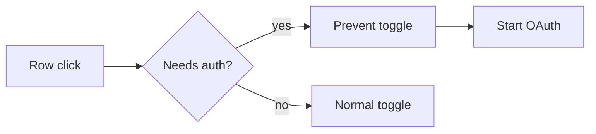

# PR Notes

Write for the reviewer, not the author.

The goal is to compress the context needed to review a change without forcing the reviewer to reconstruct intent from the diff.

Inspired by the PR presentation style shared publicly by Luke Parker (@LukeParkerDev): concise behavior description, before/after evidence, a small flow diagram when useful, and exact implementation notes.

## Reviewer contract

A strong PR note should make these clear quickly:

1. What was wrong, missing, or intentionally changed?
2. What happens now?
3. Which path through the system changed?
4. Which implementation details matter for correctness?
5. Which nearby behaviors must remain unchanged?
6. What evidence shows the change works?

If a section does not reduce reviewer uncertainty, remove it.

## Workflow

### 1. Establish the actual change

When repository context is available, inspect the diff, changed files, tests, issue or ticket, screenshots, logs, metrics, and relevant comments before writing.

Prefer source evidence over a vague summary.

Determine:

- previous observable behavior
- new observable behavior
- changed decision point or data path
- important invariants
- likely regression surface
- available evidence

Never invent screenshots, metrics, tests, edge cases, or implementation facts.

### 2. Open with the behavior delta

State the previous behavior and the new behavior in one to three sentences.

Good:

> Clicking an MCP server row that required sign-in disabled the server. Row clicks now begin sign-in while the switch still controls enabled state.

Weak:

> Updates `server-panel.tsx` to modify click handling.

Lead with behavior. Implementation comes later.

Avoid vague language such as:

- improves UX
- fixes logic
- handles edge cases
- makes this more robust
- refactors behavior

Replace it with the exact state transition, request path, user action, metric, or invariant.

### 3. Add before / after evidence when there is a real delta

For visual behavior, prefer:

1. matched before/after screenshots
2. short GIFs
3. concise textual behavior when media is unavailable

For backend, systems, or infrastructure changes, prefer comparable measured evidence:

```md
| Metric | Before | After |
|---|---:|---:|
| p95 latency | 84 ms | 51 ms |
| cache hit rate | 71% | 93% |
```

State the workload or measurement conditions when they matter.

Do not compare unrelated runs as if they were equivalent.

For behavior-preserving refactors, skip the visual before/after section and state the preserved contract instead.

### 4. Use a diagram only when it reduces review effort

Use a small Mermaid diagram for non-obvious:

- event routing
- authentication
- state transitions
- request paths
- retries and fallbacks
- controller selection
- data flow

Aim for 3-7 nodes.

Example:



Do not add a diagram when prose is faster.

Avoid full dependency maps, decorative architecture diagrams, or diagrams that simply repeat the bullets.

### 5. Document only correctness-critical implementation details

Implementation bullets should help the reviewer inspect the diff.

Strong:

- `needs_auth` rows remain enabled and disconnected until authentication completes.
- Row clicks ignore the switch control, preserving direct switch toggles.
- The toggle hook starts OAuth instead of attempting a normal connection for auth-required rows.

Weak:

- Updated click handler.
- Refactored hook.
- Fixed state.
- Changed types.

Use exact components, functions, state names, services, or invariants when they make review easier. Do not dump a file list.

### 6. Name preserved behavior

State important adjacent paths that must remain unchanged.

Examples:

- Direct switch clicks still toggle enabled state.
- Keyboard activation keeps the existing behavior.
- Non-auth rows are unchanged.
- Existing API semantics are preserved.
- Failure handling remains on the previous path.

This gives the reviewer an explicit regression checklist.

### 7. Make verification prove the changed branch

Verification should map directly to the behavior delta and likely regressions.

Strong:

- [x] Clicking an auth-required row starts OAuth.
- [x] Clicking the switch still toggles enabled state.
- [x] Non-auth rows retain the previous behavior.
- [x] Browser or unit coverage exercises both click targets.

Weak:

- [x] Tested locally.
- [x] CI passes.

CI status is useful, but it does not replace behavior-specific evidence.

Never mark a check complete unless the available context supports it. Leave unrun checks unchecked or label them pending.

## Default shape

Use the smallest useful subset:

```md
## What changed

<1-3 sentences describing previous and new behavior>

### Before / after

| Before | After |
|---|---|
| <evidence> | <evidence> |

### Flow

<small Mermaid diagram only if useful>

### Implementation

- <correctness-critical mechanism>
- <important preserved behavior>

### Verification

- [x] <changed path>
- [x] <edge case or regression path>
```

Do not force every section into every PR.

## Adapt by change type

### Tiny fix

Usually use:

- What changed
- Implementation
- Verification

Skip the diagram and before/after section if they add no value.

### UI, auth, state-machine, workflow, or controller change

Usually use:

- What changed
- Before / after
- Flow, when branching is non-obvious
- Implementation
- Verification

### Backend, performance, or infrastructure change

Prefer measured evidence. Include:

- workload or test conditions
- relevant metric delta
- changed request or data path when useful
- preserved failure semantics
- verification

### Refactor with no intended behavior change

Open with:

> Refactors `<area>` without intended user-visible behavior changes.

Then explain:

- the previous structural problem
- the new boundary
- the preserved contract
- tests or evidence supporting equivalence

Do not invent a UX delta.

### Large PR

Group by reviewer-relevant behavior or subsystem.

If the PR is too broad to explain concisely, say so rather than hiding the breadth behind a generic summary.

## Style

- concise
- technical
- literal
- short paragraphs
- exact terminology
- no marketing language
- no fake excitement
- no generic conclusion
- no commit-history narration
- no exhaustive file-by-file summary
- no filler such as "This PR aims to..."
- no unsupported claims

Stop when the reviewer has enough information to verify the change.

## Final pass

Before returning a PR note, verify:

- the opening states the behavior delta
- the change is understandable before reading the full diff
- before/after evidence is real and comparable
- the diagram, if present, explains a meaningful branch or sequence
- implementation bullets expose the mechanism that matters
- important preserved behavior is explicit
- verification covers the changed path and likely regressions
- unsupported claims are removed
- redundant prose is deleted

For extended examples and evaluation cases, see `examples/`, `references/`, and `evals/`.
