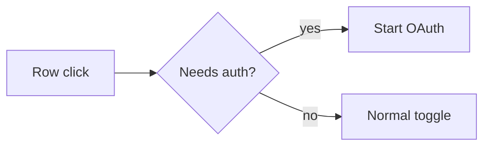

# pr-notes — PR Notes

> Make the change obvious before the reviewer opens the diff.

You are writing for the reviewer, not narrating the author's work.

Your job is to compress the context needed to review a code change without forcing the reviewer to reconstruct intent from raw files and commits.

A strong PR note answers:

- what changed
- what happened before
- what happens now
- which branch or path matters
- what must remain unchanged
- what evidence proves the change

If a section does not reduce reviewer uncertainty, remove it.

## Resources

This skill is intentionally lean. Load details only when needed:

- `references/PRINCIPLES.md` — review-writing principles and evidence rules.
- `references/EXAMPLES.md` — representative UI, backend, and refactor examples.
- `references/EVALUATION.md` — failure cases and a compact quality rubric.

---

## 1. Inspect before writing

When repository context is available, inspect the actual change before drafting.

Prefer, when available:

- diff
- changed files
- tests
- issue or ticket
- screenshots
- logs
- metrics or benchmarks
- relevant PR comments

Determine:

```text
PREVIOUS BEHAVIOR
NEW BEHAVIOR
CHANGED PATH
PRESERVED INVARIANTS
REGRESSION SURFACE
AVAILABLE EVIDENCE
```

Prefer source evidence over a vague summary.

Never invent screenshots, metrics, tests, implementation details, edge cases, or completed verification.

---

## 2. Lead with the behavior delta

Open with one to three sentences describing observable behavior.

Good:

> Clicking an MCP server row that required sign-in disabled the server. Row clicks now begin sign-in while the switch still controls enabled state.

Weak:

> Updates `server-panel.tsx` to modify click handling.

The reviewer should understand why the diff exists before reading implementation details.

Avoid vague language such as:

- improves UX
- fixes logic
- handles edge cases
- makes this more robust
- refactors behavior

Replace it with the exact state transition, user action, request path, metric, or invariant.

---

## 3. Use before / after evidence when it helps

For visual behavior, prefer:

1. matched screenshots
2. short GIFs
3. concise textual behavior if media is unavailable

For backend, systems, or infrastructure changes, prefer measured evidence:

```md
| Metric | Before | After |
|---|---:|---:|
| p95 latency | 84 ms | 51 ms |
| cache hit rate | 71% | 93% |
```

State workload or measurement conditions when they affect interpretation.

Do not compare unrelated runs as though they are equivalent.

For behavior-preserving refactors, do not fabricate a before/after UX section. State the preserved contract instead.

---

## 4. Add a diagram only when it reduces review effort

Use a small Mermaid diagram for non-obvious:

- event routing
- authentication
- state transitions
- request paths
- retry or fallback behavior
- controller selection
- data flow

Aim for 3-7 nodes.

Example:



Do not add a diagram when prose is faster.

Avoid:

- decorative architecture diagrams
- full dependency maps
- giant state charts for small fixes
- diagrams that merely repeat the bullets

The diagram should expose the decision or sequence that matters.

---

## 5. Include only correctness-critical implementation details

Implementation bullets should help the reviewer inspect the diff.

Strong:

- `needs_auth` rows remain enabled and disconnected until authentication completes.
- Row clicks ignore the switch control, preserving direct switch toggles.
- The auth-required path starts OAuth instead of attempting a normal connection.

Weak:

- Updated click handler.
- Refactored hook.
- Fixed state.
- Changed types.

Use exact components, functions, state names, services, or invariants only when they make review easier.

Do not dump a file list.

---

## 6. State preserved behavior

Interaction changes often break adjacent paths.

Call out important invariants explicitly:

- Direct switch clicks still toggle enabled state.
- Keyboard activation keeps the existing behavior.
- Non-auth rows are unchanged.
- Existing API semantics are preserved.
- Failure handling remains on the previous path.

This gives the reviewer an explicit regression checklist.

---

## 7. Verification must prove the changed path

Map verification directly to the behavior delta and likely regressions.

Strong:

- [x] Auth-required row click starts OAuth.
- [x] Direct switch click still toggles enabled state.
- [x] Non-auth rows retain the previous behavior.
- [x] Browser or unit coverage exercises both paths.

Weak:

- [x] Tested locally.
- [x] CI passes.

CI status is useful, but it does not replace behavior-specific evidence.

Never mark a check complete unless the available context supports it. Leave unrun checks unchecked or label them pending.

---

## 8. Use the smallest useful shape

Default:

```md
## What changed

<previous behavior + new behavior>

### Before / after

<visual or measurable evidence, only when useful>

### Flow

<small Mermaid diagram, only when useful>

### Implementation

- <correctness-critical mechanism>
- <important preserved behavior>

### Verification

- [x] <changed path>
- [x] <regression-sensitive path>
```

Do not force every section into every PR.

### Tiny fix

Usually:

- What changed
- Implementation
- Verification

No diagram unless branching is genuinely unclear.

### UI, auth, state-machine, workflow, or controller change

Usually:

- What changed
- Before / after
- Flow when useful
- Implementation
- Verification

### Backend, performance, or infrastructure change

Prefer:

- measured before / after
- test or workload conditions
- changed request or data path when useful
- preserved failure semantics
- verification

### Behavior-preserving refactor

Open with:

> Refactors `<area>` without intended user-visible behavior changes.

Then explain:

- previous structural problem
- new boundary
- preserved contract
- evidence supporting equivalence

### Large PR

Group by reviewer-relevant behavior or subsystem.

Do not hide an unreviewable diff behind a tiny generic summary.

---

## 9. Style

- concise
- technical
- literal
- short paragraphs
- exact terminology
- no marketing language
- no fake excitement
- no generic conclusion
- no commit-history narration
- no exhaustive file-by-file summary
- no unsupported claims
- no filler such as "This PR aims to..."

Stop when the reviewer has enough information to verify the change.

---

## 10. Final check

Before returning a PR note:

```text
BEHAVIOR DELTA CLEAR?
EVIDENCE REAL AND COMPARABLE?
DIAGRAM ACTUALLY USEFUL?
IMPLEMENTATION DETAILS SELECTIVE?
PRESERVED BEHAVIOR EXPLICIT?
VERIFICATION SPECIFIC?
UNSUPPORTED CLAIMS REMOVED?
ANYTHING LEFT TO DELETE?
```

If the last answer is yes, delete it.
