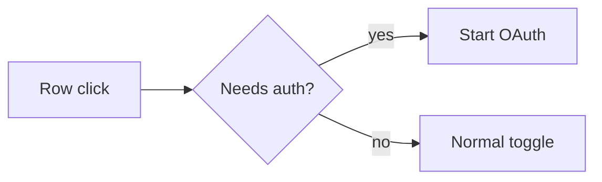

# pr-notes

Turns a code change into a review note: what moved, what proves it, what must not move.

Aim for a reviewer who reads the note once and opens the diff already knowing where to look.

Examples here and in the references are illustrations. Never copy a sentence from one into a real note.

## Resources

Load these only when needed:

- `references/PRINCIPLES.md`: evidence rules, restraint, hard cases (security, migrations, large PRs, generated code).
- `references/VISUAL-EVIDENCE.md`: before/after screenshot capture.
- `references/EXAMPLES.md`: shape references. Their details are invented.
- `references/EVALUATION.md`: failure modes and a rubric.

---

## 1. Read the change before writing

Inspect the diff and the evidence around it first. Then write.

```text
PREVIOUS BEHAVIOR
NEW BEHAVIOR
CHANGED PATH
PRESERVED INVARIANTS
REGRESSION SURFACE
EVIDENCE AVAILABLE
```

- The diff is the source of truth for what changed. The issue is the source of truth for intent. If they disagree, say so in the note.
- If you cannot read the diff, say which parts you could not inspect. Do not reconstruct a change from an issue title, a commit message, or a list of file names.
- Label what you inferred: `inferred: the caller already retries, so only the first failure reaches this path`. An unlabelled guess is not acceptable.
- Never invent screenshots, metrics, tests, implementation details, edge cases, or completed verification.

---

## 2. Lead with the behavior delta

Two sentences maximum. Then stop.

> Two concurrent retries could both execute. `claim(key)` now takes the key with a conditional insert, and the loser returns the winner's result.

Weak:

> Updates `claim.ts` to fix a race in the idempotency path.

If there is no user-visible behavior delta, say that in one sentence and name the class: refactor, dependency, docs, generated code, internal infrastructure.

Cut vague language: improves UX, fixes logic, handles edge cases, more robust, refactors behavior. Use the exact state transition, request path, metric, or invariant.

---

## 3. Evidence

Evidence counts only when it is real, current, and comparable. Most notes need none.

### Visual changes

Ask one question: can the changed behavior be seen?

A README, an MDX page, a docs site, a stylesheet, a rendered table, a diagram, a code block, and a page outline are all as visible as a button. If the change alters what someone looks at, it is a visual change and it needs a capture.

Capture order:

1. reproduce the old behavior before the change (base branch, `git stash`, previous build, deployed version)
2. capture BEFORE
3. apply the change
4. reproduce the identical scenario
5. capture AFTER

Hold viewport, zoom, theme, and app state constant between the pair, then crop to the region that changed. Put the pair side by side in the note.

Store captures under `.pr-notes/screenshots/` as `before-<short-name>.png` and `after-<short-name>.png`, and add the exact root entry `/.pr-notes/` to `.gitignore` unless the user wants the images committed. Local copies stay untracked. Attach or upload the selected images through the normal PR workflow when the note needs hosted URLs.

If the old state cannot be reproduced, say the BEFORE image is unavailable and describe the old behavior in text. Do not fabricate one.

Do not force captures for backend-only, refactor-only, or otherwise invisible changes. Documentation is not exempt: if the file is rendered anywhere, capture it. Full protocol: `references/VISUAL-EVIDENCE.md`.

### Measured changes

For performance, latency, throughput, or resource changes, use numbers you measured:

| Metric | Before | After |
|---|---:|---:|
| p95 latency | 84 ms | 51 ms |

State the workload, hardware, and build mode when they affect interpretation. Do not present runs from different conditions as a before/after pair.

If you did not measure it, say the impact is unmeasured. Do not print a delta table with one real column, and do not turn "should be faster" into a result.

Never use screenshots, logs, or metrics that predate the change as if they were captured after it.

---

## 4. Diagrams

Most notes have no diagram. That is the normal case, not a gap.

Draw one only when the changed path has a branch or sequence that is hard to hold in your head from prose.


```mermaid
flowchart LR
    A[Row click] --> B{Needs auth?}
    B -- yes --> C[Start OAuth]
    B -- no --> D[Normal toggle]
```

- 3 to 7 nodes.
- At most one diagram per behavior group. Never one spanning unrelated subsystems.
- If you can state the path in one sentence, do not draw it.
- No decorative architecture diagrams, dependency maps, or diagrams that restate the bullets.

Show the decision that matters, not the file layout.

---

## 5. Implementation details: only what a reviewer must verify

Three bullets maximum. Most changes need two.

Each bullet has to pass one test: would a reviewer be unable to confirm this change is correct without this line?

Strong:

- `needs_auth` rows stay enabled and disconnected until authentication completes.
- The write and the index update happen in one transaction, so a reader cannot see the row without its index entry.

Weak: "Updated the click handler." / "Refactored the hook." / "Changed types." / a list of touched files.

Never explain the surrounding system. If the change needs architecture context to review, link the doc. Do not restate it.

---

## 6. Preserved behavior

At most three invariants. If you cannot rank them, the change is too broad for one note.

- Direct switch clicks still toggle enabled state.
- Keyboard activation is unchanged.
- Existing API response shape is unchanged.

This is the regression checklist.

---

## 7. Verification must prove the changed path

Three lines maximum. Each line names a path and the evidence behind it.

```md
- [x] Auth-required row click starts sign-in (manual run, captured above)
- [x] Direct switch click still toggles (`toggle.test.ts`, unchanged)
- [ ] Timeout path (not run, no harness yet)
```

- A checked box requires a result you observed. If you did not run it, leave it unchecked and write why.
- If tests fail, say which ones fail and why the change still stands.
- If CI has not run, write "CI not run". Never imply a green run.
- Say which paths are covered and which are not. Partial coverage is not proof of the whole path.
- "Tested locally" and "CI passes" are not evidence. Name the test, command, or manual step.

---

## 8. Shape and length

Write for a reviewer who is skimming. Most notes are three sections and under 15 lines.

This is the default, and usually the whole note:

```md
## What changed
### Implementation
### Verification
```

Add a section only when it applies: `### Before / after` with real evidence, `### Flow` with a diagram, `### Preserved` when a real invariant could break.

| Change | Add beyond "what changed" |
|---|---|
| Tiny fix / null guard | the exact condition and the path that no longer reaches it |
| UI / interaction / rendered output | before/after captures, or a statement that they are unavailable |
| Auth / event routing / state machine | the decision point |
| Backend / performance / cache / systems | measured delta with conditions, or "not measured"; the invariant that makes it correct |
| Behavior-preserving refactor | the structural problem removed, the new boundary, equivalence evidence |
| Schema or data migration | forward and rollback direction, existing rows, safe before or after the deploy |
| Dependency bump / generated code | version and reason, or generator, input, and regenerate command |
| Docs or prose, text only | what a reader now learns. If the file is rendered, use the row above. |
| Security-sensitive | the trust boundary that moved, what is newly possible, what is not covered |
| Large multi-subsystem | review order in at most three lines; what is mechanical, what is out of scope |

Hard caps:

- 2 sentences in `## What changed`
- 3 implementation bullets
- 3 verification lines
- 1 diagram, or none
- 15 lines total. A tiny fix is 3 to 5.

If a cap does not hold, the note is describing two changes. Split the PR, or say in one line what is out of scope.

---

## 9. Tone

Short declarative sentences. Name the thing, not the change to the thing. Use the code's own terms.

Delete on sight:

- sentences that restate the diff
- purpose and framing openers: "The goal here is", "This ensures that", "In order to"
- hedges: typically, generally, essentially, it is worth noting
- connectors: Additionally, Furthermore, Moreover, Notably
- triads: "fast, simple, and reliable"
- closers: "In short", "Overall", "With this change"
- the same fact twice, once in prose and once in a bullet
- any sentence the diff already says

---

## 10. Final check

```text
BEHAVIOR DELTA IN TWO SENTENCES OR LESS?
EVIDENCE REAL, CURRENT, COMPARABLE?
VISUAL CHANGE HAS CAPTURES OR AN HONEST "UNAVAILABLE"?
DIAGRAM PRESENT ONLY IF IT HELPS?
IMPLEMENTATION BULLETS THREE OR FEWER?
VERIFICATION NAMES A PATH AND ITS EVIDENCE?
UNDER 15 LINES?
NO LINE THAT RESTATES THE DIFF?
ANY COMMENTARY ABOUT THE NOTE ITSELF?
ANYTHING UNSUPPORTED OR UNNEEDED LEFT?
```

If the last answer is yes, delete it.
