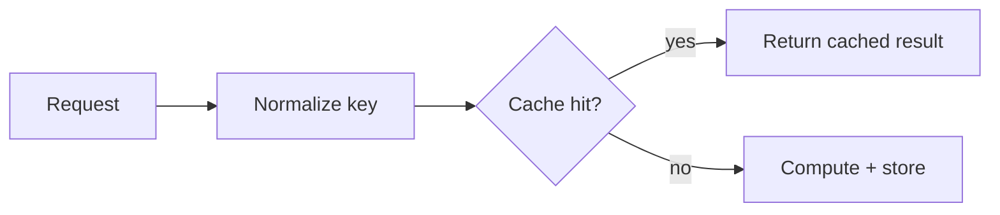

# Backend performance change

## What changed

The response cache now reuses normalized query keys instead of storing equivalent queries under multiple representations. Under the benchmark workload, this reduces duplicate misses without changing invalidation semantics.

### Before / after

| Metric | Before | After |
|---|---:|---:|
| Cache hit rate | 72.4% | 91.8% |
| p95 lookup latency | 18.6 ms | 11.2 ms |

Benchmark: 100k requests, fixed trace, warm cache, same hardware and build mode.

### Flow

### Implementation

- Query normalization runs before cache lookup and insertion.
- Invalidation still operates on the canonical key.
- Cache capacity and eviction policy are unchanged.

### Verification

- [x] Fixed-trace benchmark repeated with the same workload.
- [x] Equivalent query forms resolve to the same key.
- [x] Invalidation removes the normalized entry.
- [x] Existing eviction tests pass.

> The numbers above are illustrative. Real PR notes must use measurements from the actual change and workload.
