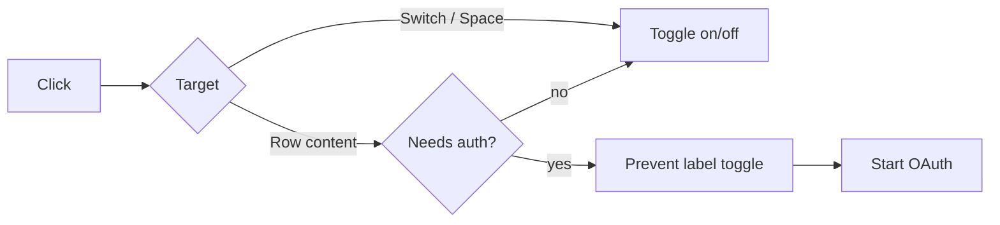

# UI / auth interaction fix

## What changed

Clicking the row of an MCP server that showed **Sign in required** disabled the server instead of starting authentication. The row now starts sign-in, while the switch remains the control for enabled state.

### Before / after

| Before | After |
|---|---|
| Row click turns the server off | Row click opens sign-in and leaves it enabled |

### Flow

### Implementation

- `needs_auth` rows remain enabled and disconnected until authentication completes.
- Row handling ignores direct switch-control clicks so the switch keeps its previous behavior.
- Clicking the rest of an auth-required row routes into OAuth.
- Non-auth rows retain the existing toggle behavior.

### Verification

- [x] Auth-required row click starts sign-in.
- [x] Direct switch click still toggles enabled state.
- [x] Non-auth rows behave as before.
- [x] Keyboard switch interaction remains on the existing path.
