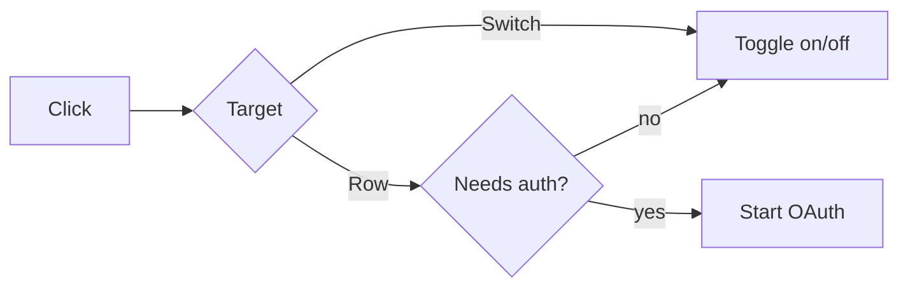

# Examples

These are shape references, not templates. Every fact in them is invented, including metrics, file names, and test names. Never reuse their numbers, wording, or structure verbatim. Match the shape to the actual change or leave it out.

---

## Tiny fix

### What changed

A missing `session` object made `formatUser` throw instead of returning the anonymous profile. It now falls back to the anonymous profile when no session is present.

### Implementation

- The guard sits in `formatUser`, so every caller is covered, not just the reporting path.

### Verification

- [x] `format-user.test.ts` covers the absent-session case.

No evidence section, no diagram. Three lines of content plus headings.

---

## UI interaction

### What changed

Clicking the row of an MCP server that showed **Sign in required** disabled the server instead of starting authentication. The row now starts sign-in, while the switch remains the control for enabled state.

### Before / after

| Before | After |
|---|---|
|  |  |

Captured at 1440×900, light theme, same seeded account, cropped to the server row. The error state is not covered.

### Flow

### Implementation

- `needs_auth` rows stay enabled and disconnected until authentication completes.
- Non-auth rows keep the previous path.

### Verification

- [x] Auth-required row click starts sign-in (manual run, captured above)
- [x] Direct switch click still toggles enabled state (`toggle.test.ts`)
- [x] Non-auth rows behave as before (existing suite, unchanged)

---

## Backend performance change

### What changed

The response cache now reuses normalized query keys instead of storing equivalent queries under multiple representations. Under the benchmark workload this removes duplicate misses, without changing invalidation semantics.

### Before / after

| Metric | Before | After |
|---|---:|---:|
| Cache hit rate | 72.4% | 91.8% |
| p95 lookup latency | 18.6 ms | 11.2 ms |

Benchmark: 100k requests, fixed trace, warm cache, same hardware and build mode.

### Implementation

- Query normalization runs before lookup and insertion.
- Invalidation still operates on the canonical key, so one entry cannot outlive the others.
- Capacity and eviction policy are unchanged.

### Verification

- [x] Fixed-trace benchmark repeated on the same workload and hardware.
- [x] Equivalent query forms resolve to the same key (`normalize-key.test.ts`).
- [x] Existing eviction tests pass.

---

## Behavior-preserving refactor

### What changed

Refactors request retry policy construction into a single module. No runtime behavior change is intended.

The previous implementation duplicated retry limits and backoff selection across three call sites. The new module owns policy construction and preserves the existing retry contract.

### Implementation

- All call sites request a policy from `retry-policy.ts`.
- Retry count, backoff schedule, and retryable status codes are unchanged.
- Callers still own cancellation and timeout behavior.

### Verification

- [x] Existing retry behavior tests pass unchanged.
- [x] Snapshot coverage confirms the same policy for each previous call site.
- [ ] Caller-level cancellation (not re-run, no change to that path)

---

## Schema migration

### What changed

Adds `orders.settled_at`, backfilled from `payment_events` for existing rows. New orders set it on settlement.

### Implementation

- Forward: add the nullable column, backfill in batches of 5k, then add the index concurrently.
- Rollback: drop the column. No data loss beyond the derived value.
- Safe to run before the code deploy: the column is nullable and unread until the new code is live.
- Existing rows keep `settled_at` null when no matching payment event exists.

### Verification

- [x] Migration and rollback run against a production-shaped snapshot.
- [x] Backfill leaves no rows with a matching event unset (`backfill-settled-at.sql` check query)
- [ ] Lock duration on the largest table (not measured; expect a brief `ACCESS EXCLUSIVE` during column add)

---

## Large multi-subsystem PR

### What changed

Moves workspace authorization from per-route checks into a shared policy layer and deletes the route-level duplicates. User-visible behavior is intended to be unchanged.

Review order:

1. `policy/`: the new layer and the decision function. This is the part that needs thought.
2. Route diffs: mechanical removal of the old checks. Skim for a route that dropped a check without a policy replacement.
3. Test moves: relocated, not rewritten.

### Implementation

- Every route now resolves permissions through `authorize(user, action, resource)`; the old per-route `can*` helpers are deleted.
- Deny-by-default: an action with no policy entry is refused, matching the previous behavior for unlisted routes.
- Shared invariants: workspace scoping is still resolved from the session, never from request input.

Out of scope: the admin console still uses its own checks.

### Verification

- [x] Route inventory script confirms every deleted `can*` call has a policy equivalent.
- [x] Existing authorization suite passes unchanged.
- [ ] Admin console paths (unchanged by this PR, not covered here)
