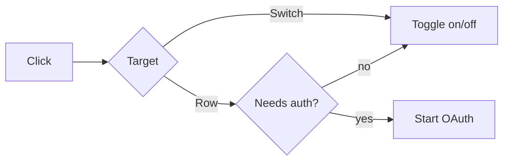

# Examples

## UI / auth interaction

### What changed

Clicking the row of an MCP server that showed **Sign in required** disabled the server instead of starting authentication. The row now starts sign-in, while the switch remains the control for enabled state.

### Before / after

| Before | After |
|---|---|
| Row click turns the server off | Row click opens sign-in and leaves it enabled |

### Flow

### Implementation

- `needs_auth` rows remain enabled and disconnected until authentication completes.
- Direct switch clicks preserve the existing toggle behavior.
- Non-auth rows are unchanged.

### Verification

- [x] Auth-required row click starts sign-in.
- [x] Direct switch click still toggles enabled state.
- [x] Non-auth rows behave as before.

---

## Backend performance change

### What changed

The response cache now reuses normalized query keys instead of storing equivalent queries under multiple representations. Under the benchmark workload, this reduces duplicate misses without changing invalidation semantics.

### Before / after

| Metric | Before | After |
|---|---:|---:|
| Cache hit rate | 72.4% | 91.8% |
| p95 lookup latency | 18.6 ms | 11.2 ms |

Benchmark: 100k requests, fixed trace, warm cache, same hardware and build mode.

### Implementation

- Query normalization runs before cache lookup and insertion.
- Invalidation still operates on the canonical key.
- Capacity and eviction policy are unchanged.

### Verification

- [x] Fixed-trace benchmark repeated with the same workload.
- [x] Equivalent query forms resolve to the same key.
- [x] Existing eviction tests pass.

The numbers above are illustrative. Real PR notes must use measurements from the actual change.

---

## Behavior-preserving refactor

### What changed

Refactors request retry policy construction into a single module without intended runtime behavior changes.

The previous implementation duplicated retry limits and backoff selection across three call sites. The new module owns policy construction while preserving the existing retry contract.

### Implementation

- All call sites now request a policy from `retry-policy.ts`.
- Retry count, backoff schedule, and retryable status codes are unchanged.
- Callers still own cancellation and timeout behavior.

### Verification

- [x] Existing retry behavior tests pass unchanged.
- [x] Snapshot coverage confirms the same policy for each previous call site.
- [x] Cancellation and timeout tests remain green.
