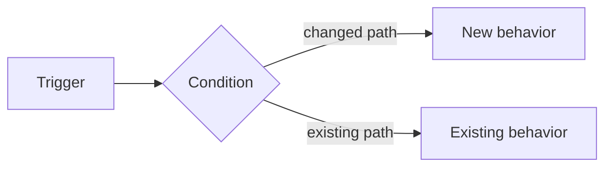

## What changed

<!-- State the previous behavior and the new behavior in 1-3 sentences. -->

### Before / after

<!-- Include only when there is meaningful visual or measurable evidence. -->

| Before | After |
|---|---|
| <!-- evidence --> | <!-- evidence --> |

### Flow

<!-- Omit when prose is clearer. Keep Mermaid focused on the changed branch. -->

### Implementation

- <!-- correctness-critical mechanism -->
- <!-- important preserved behavior / invariant -->

### Verification

- [ ] <!-- changed path -->
- [ ] <!-- edge case -->
- [ ] <!-- regression-sensitive unchanged path -->
